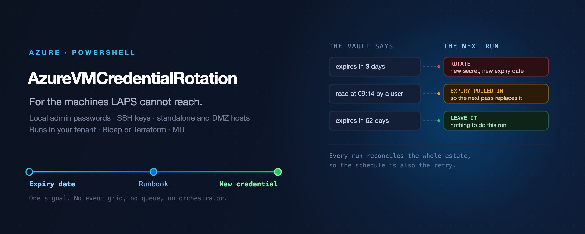

# azure-vm-credential-rotation



Credential lifecycle for Azure VMs that **cannot use Windows LAPS or Entra login**.

Rotates local administrator passwords and SSH keys on a schedule, and — optionally —
within hours of somebody reading one out of Key Vault.

```
Key Vault expiry date  ──┐
                         ├──▶  Automation runbook  ──▶  VMAccess extension  ──▶  VM
Key Vault audit log    ──┘            │
  (someone read it)                   └──▶  Log Analytics: who read it, when it was replaced
```

---

## Read this first

**If your machines are Entra-joined, hybrid-joined or AD-joined, use [Windows LAPS](https://learn.microsoft.com/en-us/windows-server/identity/laps/laps-overview) instead.**
It is built in, free, better integrated, and rotates on use natively. This project
exists for the machines LAPS cannot reach.

Likewise, if you can use [Entra login for Azure VMs](https://learn.microsoft.com/en-us/entra/identity/devices/howto-vm-sign-in-azure-ad-windows),
do that — a local credential you never issue is one you never have to rotate.

What is left over is a real population: standalone Azure VMs, jump boxes, DMZ hosts,
appliance images, test landing zones without identity integration, and **Linux SSH
keys, for which Azure offers no native rotation at all**. That is the target.

See [docs/when-not-to-use-this.md](docs/when-not-to-use-this.md) for the full
decision matrix.

---

## How it works

One idea carries the whole design: **the Key Vault expiry date is the only signal.**

A scheduled run asks two questions and acts on the answers:

1. *Which credentials are near expiry?* → rotate them.
2. *Which credentials did a human read since the last run?* → move their expiry date
   forward by the grace period, so question 1 picks them up on the next pass.

That is why there is no Event Grid subscription, no queue, no orchestrator and no
second code path for rotation-after-use. Access does not trigger a job; it writes a
date. And because every run reconciles the whole estate, **the schedule is also the
retry**: a powered-off VM, a throttled call, an unhealthy guest agent — all of it is
simply picked up next time.

The trade is latency. With a six-hour schedule and an eight-hour grace period, a
credential read at 09:00 is replaced some time before 23:00, not within minutes. For
credentials that would otherwise sit unchanged for ninety days, that is not a
meaningful loss. If it is for you, [ADR 0002](docs/decisions/0002-reconciliation-loop-over-events.md)
describes what an event-driven version would take and why it costs more than it looks.

---

## Deploy

Two ways in, one tool. They create the same resources and configure the runbook through the same
`CR_*` automation variables — a test compares the two sets on every push, so they cannot quietly
drift apart. [ADR 0007](docs/decisions/0007-bicep-beside-terraform.md) says why both exist.

### Bicep

[](https://portal.azure.com/#create/Microsoft.Template/uri/https%3A%2F%2Fraw.githubusercontent.com%2Fsimon-vedder%2Fazure-vm-credential-rotation%2Fmain%2Fdeploy%2Fazuredeploy.json)

Or one command, everything in it, dry-run by default:

```bash
az deployment sub create \
  --location switzerlandnorth \
  --template-file deploy/main.bicep \
  --parameters moduleVersion=0.1.0 \
               keyVaultName=kv-credentials \
               keyVaultResourceGroupName=rg-vault \
               targetResourceGroupNames='["rg-workloads"]'
```

Feature flags rather than stacked modules: `deployObservability` for the audit trail (on),
`enableRotateOnAccess` for rotation after use (off), `dryRun` for whether anything is actually
replaced (on, deliberately). Full parameter list and a `what-if` recipe in [`deploy/`](deploy).

### Terraform

Three modules that stack. `core` works alone.

| module | what it adds | needs |
|---|---|---|
| [`core`](infra/modules/core) | runbook, schedule, identity, permissions — calendar rotation | an existing Key Vault with RBAC authorisation |
| [`observability`](infra/modules/observability) | workspace, custom table, workbook — the audit trail | `core` |
| [`rotate-on-access`](infra/modules/rotate-on-access) | rotation after use | `observability` |

```hcl
module "rotation" {
  source = "github.com/simon-vedder/azure-vm-credential-rotation//infra/modules/core"

  resource_group_name     = azurerm_resource_group.this.name
  location                = "switzerlandnorth"
  automation_account_name = "aa-credential-rotation"

  key_vault_id   = data.azurerm_key_vault.this.id
  key_vault_name = data.azurerm_key_vault.this.name
  vm_scopes      = [azurerm_resource_group.workloads.id]

  dry_run = true   # leave this on until you have read one run's output
}
```

Working examples: [01-minimal](infra/examples/01-minimal) and
[02-full](infra/examples/02-full).

The Terraform path publishes the flattened runbook artefact from `build/Build-Runbook.ps1`; the
Bicep path imports the module from the PowerShell Gallery instead. The runbook wrapper works either
way — see [ADR 0006](docs/decisions/0006-the-module-goes-to-the-gallery.md).

### Opting a machine in

Nothing is rotated until you say so. Discovery is opt-in by tag, because a tool that
treats "no secret exists for this VM" as "rotate it" will, on its first run in an
established tenant, change the local administrator password of every machine it can
see.

```bash
az vm update --ids <vm-id> --set tags.CredentialRotation=enabled

# stop rotating one machine without untagging it (break-glass, maintenance)
az vm update --ids <vm-id> --set tags.CredentialRotationHold=true
```

---

## What it does to your machines

Worth knowing before you run it, not after:

- **Credentials are applied with the VMAccess extension.** If the account named in
  the VM's OS profile no longer exists on the machine, VMAccess **recreates it as a
  local administrator**. Someone may have removed that account deliberately.
- **`remove_prior_keys` and `reset_ssh` default to off**, unlike most examples you
  will find. The first wipes every entry in `authorized_keys` — colleagues,
  configuration management, backup agents. The second can restore `sshd_config` to
  its default and undo hardening.
- **Only running VMs are touched.** A stopped VM is skipped and retried, never
  half-rotated.
- **The identity needs Virtual Machine Contributor**, which includes installing
  extensions — effectively code execution as SYSTEM or root in scope. Scope it to
  resource groups, not subscriptions.

Full analysis in [docs/threat-model.md](docs/threat-model.md).

---

## Not losing credentials

The failure that matters is: the VM has a new password, and nobody knows it.

Rotation stages the value before applying it. The new credential is written to a
separate `<name>-pending` secret, then applied to the VM, then promoted to `<name>`,
then the staging secret is closed. A crash at any point leaves the value recoverable,
and the next run resumes the interrupted rotation instead of generating a new one.

Two related details, both learned the hard way:

- Reading secret metadata distinguishes *absent* from *unreadable*. A denied role
  assignment must never be interpreted as "no secret here, better rotate".
- The staging secret is overwritten once consumed, rather than deleted or disabled.
  Deleting reserves the name until it is purged; disabling makes it unreadable, and
  Key Vault reports that as a 403 indistinguishable from a missing role assignment -
  which, since the engine refuses to treat an unreadable secret as absent, took down
  discovery for a whole subscription during testing.

---

## Development

```bash
pwsh -c './build/Build-Runbook.ps1'          # flatten src/ into the core module
pwsh -c './build/Build-Runbook.ps1 -Check'   # verify the artefact matches src/  (CI)
pwsh -c 'Invoke-Pester ./tests'
pwsh -c 'Invoke-ScriptAnalyzer -Path ./src -Recurse -Settings ./PSScriptAnalyzerSettings.psd1'
terraform -chdir=infra/examples/02-full validate
```

The logic lives in a proper PowerShell module under [`src/AzureVMCredentialRotation`](src/AzureVMCredentialRotation)
so it can be tested and run locally. Azure Automation executes one script per job, so
`build/Build-Runbook.ps1` flattens it into [`infra/modules/core/runbook/`](infra/modules/core/runbook), which is committed —
deploying needs no build step. CI fails if the two drift apart.

Run it locally against a single VM before trusting a schedule:

```powershell
Import-Module ./src/AzureVMCredentialRotation
Connect-AzAccount
Invoke-CredentialRotation -VaultName kv-creds -WhatIf
```

---

## Status and limits

Version 0.1.0, **verified end to end against a live Azure tenant**: deployed from the
Terraform in this repository, rotating a real VM through a real automation account.

Confirmed working on a Linux VM (Ubuntu 24.04):

- password and SSH key rotation, both promoted into Key Vault with a 90-day expiry
- opt-in discovery — one tagged VM found, an untagged one beside it correctly ignored
- resume after an interrupted rotation, replaying a staged value from 25 minutes earlier
- access-driven rotation: a human read detected in `AZKVAuditLogs`, expiry pulled
  forward, credential replaced on the following pass
- rotation records reaching a custom table through the Logs Ingestion API, and the
  workbook query correlating reads with rotations

Still unverified, and worth knowing before you rely on them:

- **Windows.** The code path is there and mirrors the Linux one, but the live test ran
  on Linux only.
- **Hardened images.** VMAccess behaviour against a CIS-baselined host is untested.
- **Scale.** Tested with one VM. Discovery reads secret metadata per credential, so
  several hundred machines is where ARM throttling would first show up.
- **Multi-subscription.** Single subscription only so far.

Start in dry-run mode on machines you can afford to lock yourself out of.

## Licence

MIT. See [LICENSE](LICENSE).
